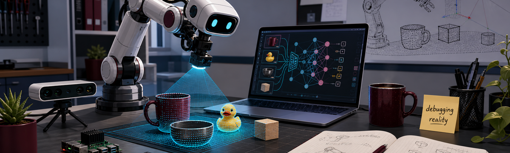
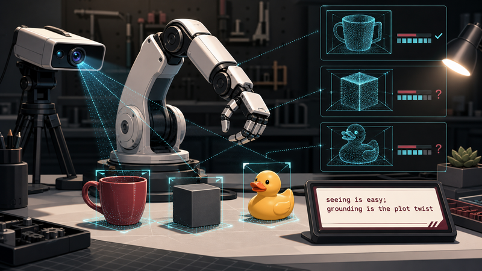
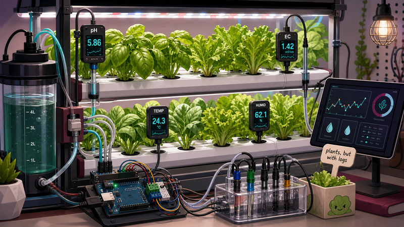

  

# MD Sameer Iqbal Chowdhury

**Ph.D. student in Computer Science at Texas State University** 
Researching vision-language models, robotic manipulation, autonomous navigation, and reliable physical AI systems.

I build and study systems where perception meets action: robots that need to see, reason, fail gracefully, and try again without making the lab regret giving them motors.

  <a href="mailto:vsj23@txstate.edu">Email</a> |
  <a href="https://msichowdhury.github.io/MSI-Chowdhury/">Academic Homepage</a> |
  <a href="https://scholar.google.com/citations?user=YGQo87AAAAJ&hl=en">Google Scholar</a> |
  <a href="https://www.linkedin.com/in/msichowdhury/">LinkedIn</a> |
  <a href="https://github.com/MSIChowdhury">GitHub</a> |
  <a href="./sameer-cv.pdf">CV</a>

## Current Focus

- Benchmarking vision-language models for robotic manipulation, from edge-friendly models such as Moondream2 and SmolVLM to larger reasoning models such as Qwen-2-VL and Florence-2.
- Studying failure detection and recovery so autonomous systems can recognize when a manipulation task has gone sideways.
- Exploring multimodal sensing, autonomous navigation, and robust embedded intelligence for real-world robotic systems.

## Featured Work

| Robotics, VLMs, and Failure Detection | Smart Hydroponics and Embedded AI |
| --- | --- |
|  |  |
| Assessing VLMs for failure detection in robotic manipulation, with an emphasis on reliability and recovery in autonomous systems. | Designed an IoT-enabled closed hydroponics system with intelligent parameter control and persistent sensing error resilience, improving fresh mass yield by 78-288%. |

## Publications

- **Assessing Vision-Language Models for Failure Detection in Robotic Manipulation** 
  MD Sameer Iqbal Chowdhury and Tsz-Chiu Au. *IEEE Pulse*, 2026. DOI: [10.1109/MPULS.2026.3659245](https://doi.org/10.1109/MPULS.2026.3659245). In press.
- **Design of an IoT-enabled Scalable Closed Hydroponics System with Intelligent Parameter Control and Persistent Sensing Error Resilience** 
  MD Sameer Iqbal Chowdhury, Mikdam-Al-Maad Ronoue, Md Asaduzzaman, and Lafifa Jamal. *Smart Agricultural Technology*, under review. DOI: [10.2139/ssrn.5011949](https://doi.org/10.2139/ssrn.5011949).
- **Exploring the Efficacy of NAO Robot as a Language Instructor** 
  Ipshita Ahmed Moon, Humayra Rashid, Safayat Hasan, MD Sameer Iqbal Chowdhury, Shifat-E-Arman, and Lafifa Jamal. *ICRAI 2024*. DOI: [10.1145/3728985.3729006](https://doi.org/10.1145/3728985.3729006).

## Technical Toolbox

**Hardware:** NVIDIA Jetson, Arduino, Raspberry Pi, sensors, actuators 
**Research stack:** VLM benchmarking, robotic manipulation, YOLO, multimodal data, embedded control

## Teaching, Leadership, and Service

- Doctoral Instructional Assistant for **CS 2308: Foundations of Computer Science II** at Texas State University, supporting two sections with 140+ students.
- Former Chair of the **IEEE Robotics & Automation Society, University of Dhaka Student Branch Chapter**, organizing robotics, Arduino, ROS, and computer vision sessions for 200+ students.
- Mentor with the **Bangladesh Robot Olympiad**, conducting robotics workshops in 15+ high schools and helping organize national rounds for 1000+ participants.

## Selected Honors

- Best Poster Award, 2nd Annual IEEE LSS EMB Workshop on AI and Healthcare, 2025.
- 2nd Place, Texas State University Capture The Flag competition conducted by EC-Council, 2025.
- ICT Innovation Fund Grant, Bangladesh ICT Division, 2023-2024, as Co-PI for the smart hydroponics project.
- Highest Mark in Country, Economics, Cambridge Assessment International Examinations, 2018.

## GitHub Snapshot

  
  

---

Currently thinking about robots that can explain what they saw, what they tried, and why the cube is still on the wrong side of the table.
